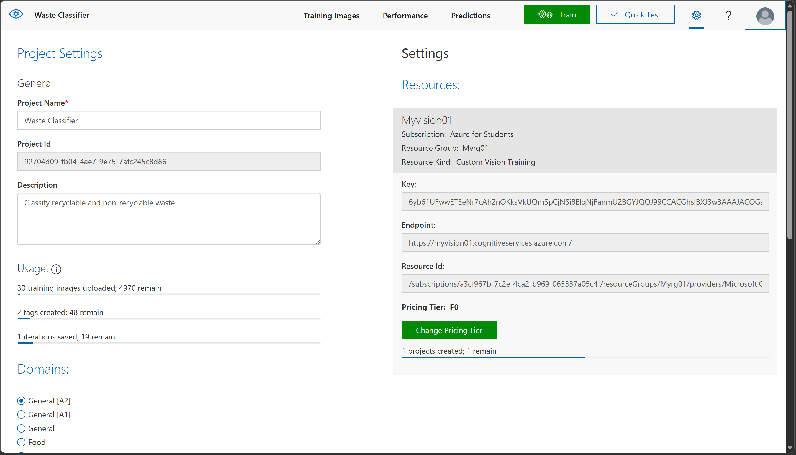
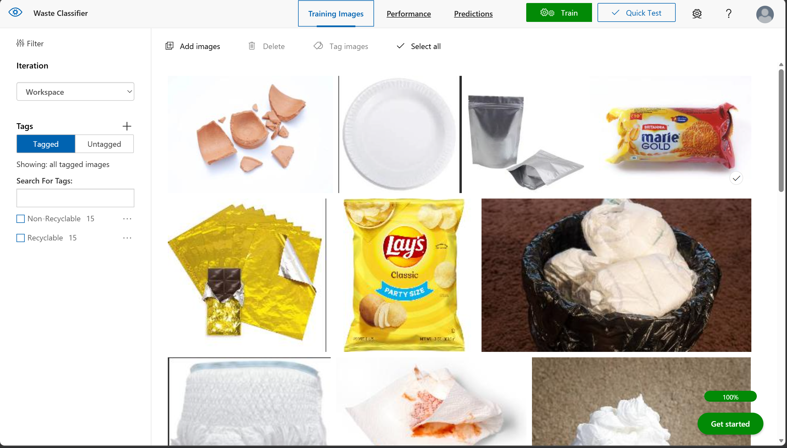
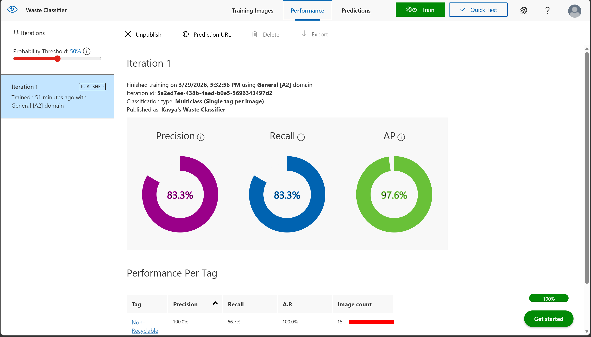
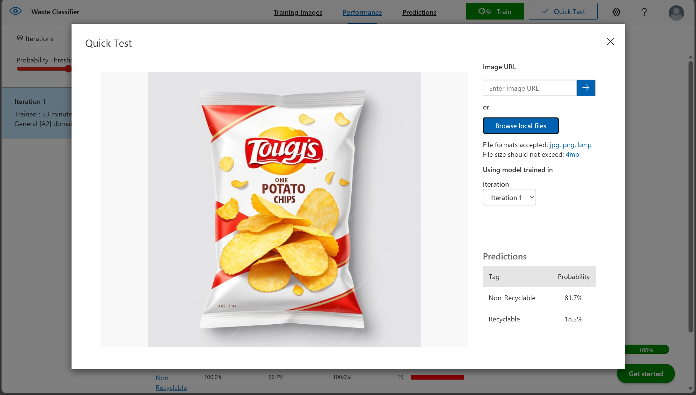

# ♻️Kavya-s-Waste-Classifier
# Waste Classification using Azure Custom Vision

## 📌 Overview
This project demonstrates how to build an AI-based image classification model using Azure Custom Vision to classify waste into two categories: **Recyclable** and **Non-Recyclable**.

---

## 🎯 Objective
To develop a machine learning model that can automatically identify and classify waste images, helping in efficient waste management and environmental sustainability.

---

## 🛠️ Tools & Technologies Used
- Microsoft Azure  
- Azure Custom Vision  
- Image Dataset (Recyclable & Non-Recyclable Waste)  
- Custom Vision Studio  

---

## ⚙️ Project Workflow
1. Created a Custom Vision resource in Azure Portal  
2. Opened Custom Vision Studio  
3. Created a new Classification Project  
4. Uploaded images for:
   - Recyclable waste  
   - Non-Recyclable waste  
5. Tagged images accordingly  
6. Trained the model using Quick Training  
7. Tested the model using new images  
8. Evaluated model performance using accuracy metrics  

---

## 🧠 Model Details
- **Project Type:** Classification  
- **Classification Type:** Multiclass (Single tag per image)  
- **Categories:**
  - Recyclable  
  - Non-Recyclable  

---

## 📊 Results
The model successfully classified waste images into recyclable and non-recyclable categories with good accuracy.  
It was able to correctly predict new images during testing with high confidence scores.

---

## 📸 Screenshots

### 🔹 Project Setup

### 🔹 Image Upload & Tagging

### 🔹 Training Results

### 🔹 Testing Results

---

## 📂 Sample Images

### ♻️ Recyclable

### 🚫 Non-Recyclable

---

## 🌍 Applications
- Smart waste management systems  
- Automated garbage segregation  
- Recycling plants  
- Environmental monitoring  

---

## 🔮 Future Improvements
- Increase dataset size for better accuracy  
- Add more waste categories  
- Integrate with real-time camera systems  
- Deploy model in mobile/web applications  

---

## 🚀 Conclusion
This project shows how AI can be used to automate waste classification and improve recycling efficiency. Azure Custom Vision makes it easy to build and deploy such intelligent systems without deep technical knowledge.

---

## 📑 Project Report
[View Full Report](project-report.pdf)

---

## 🙌 Author
**Kavya Kushwaha**
